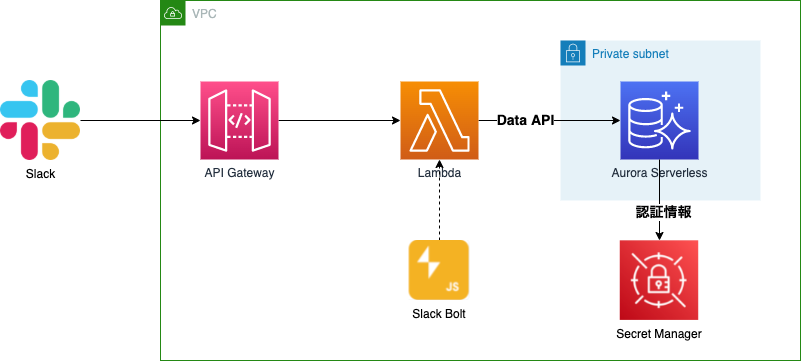
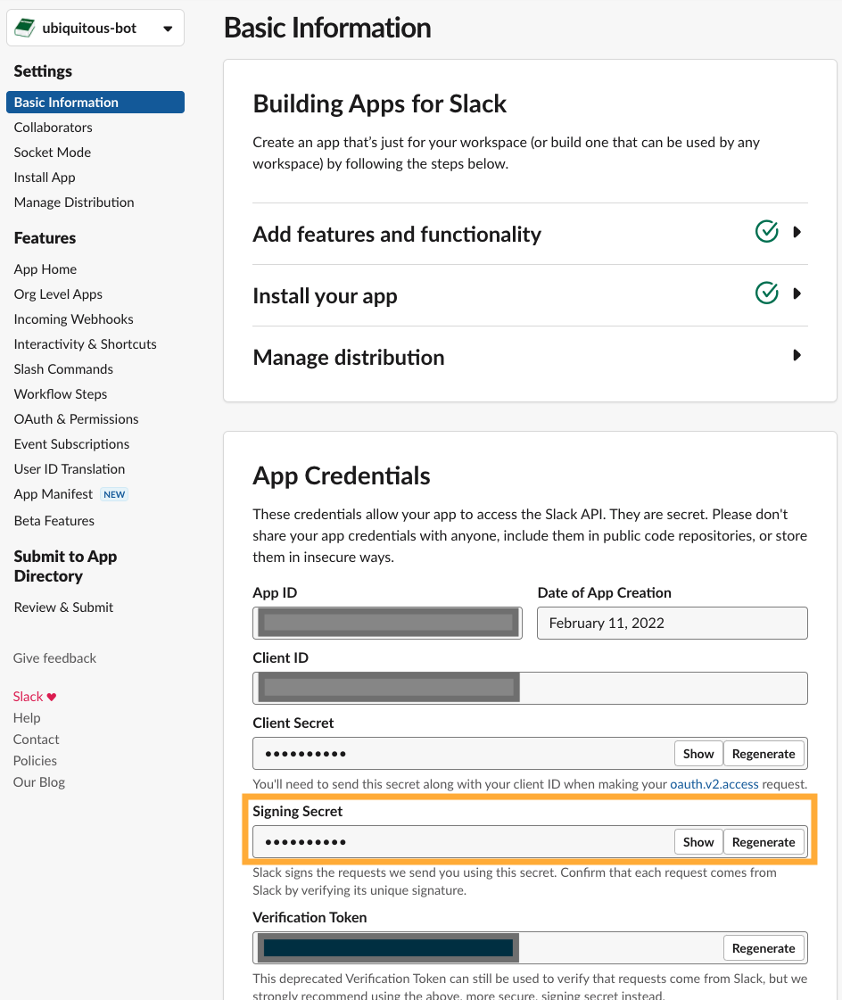
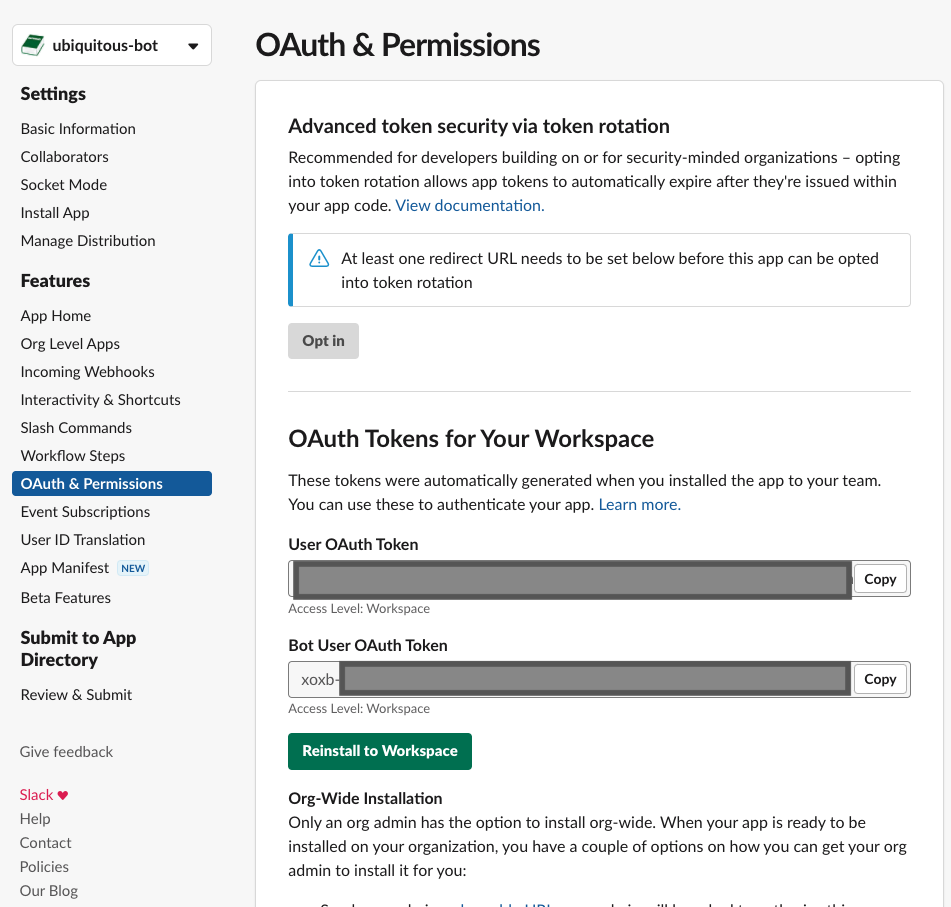
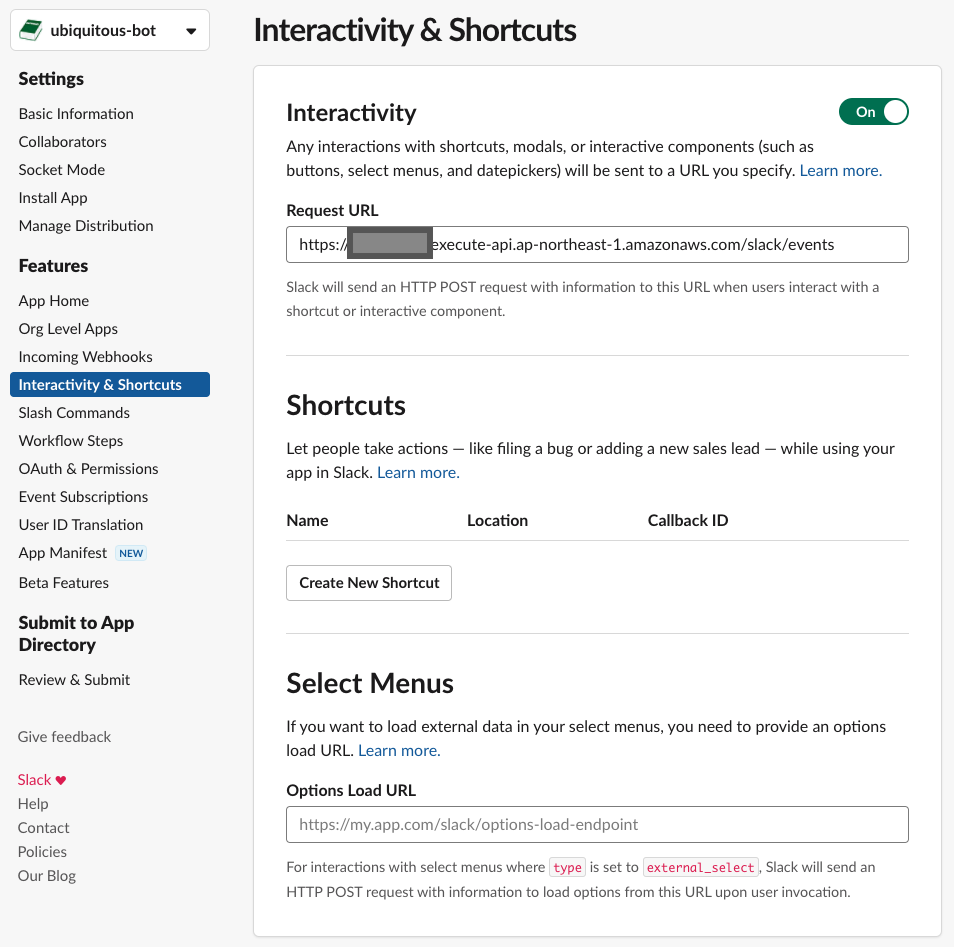
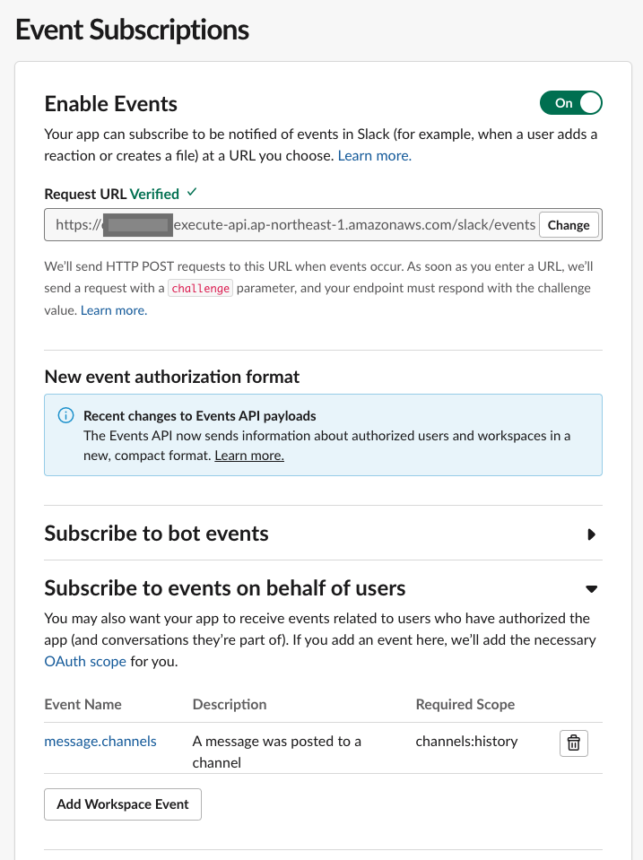
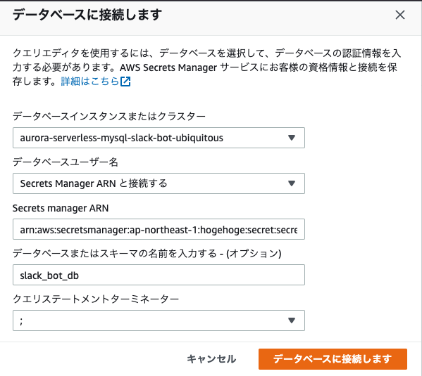

# slack-bot-ubiquitous

チームのユビキタス言語を管理するための Slack Bot

### ハイレベルアーキテクチャ



### 事前準備

- SSM に以下のパラメーターストアを登録
  - slack-bot-signing-secret
    
  - slack-bot-token
    
- デプロイ
  ```sh
  npm install
  npx sst deploy
  ```
- slack app -> Lambda の疎通確認
  - Request URL にエンドポイントを入力しておく
    
  - Request URL にエンドポイントを入力して Verified になること(失敗する場合は Lambda のログを確認)
  - Add Workspace Event に追加しないと保存できない
    
- AWS Console -> RDS -> クエリエディタ から Table を作成
  
  ```sql
  CREATE TABLE ubiquitous (
    id INT UNSIGNED AUTO_INCREMENT NOT NULL PRIMARY KEY,
    keyword TEXT NOT NULL,
    FULLTEXT (keyword) WITH PARSER ngram,
    detail TEXT NOT NULL,
    hit INT NOT NULL DEFAULT 0
  ) DEFAULT CHARSET = utf8 ENGINE=InnoDB;
  ```

### デバッグ

```sh
npx sst start
```
